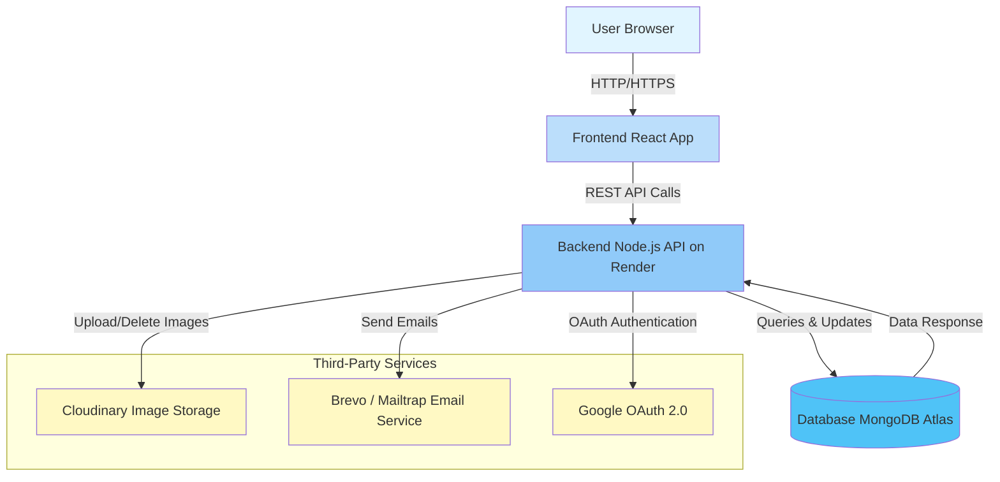

# Prompt Pal Backend - System Architecture

## High-Level System Architecture



## System Overview

**Prompt Pal** is a backend API built with modern web technologies. The system provides user authentication, profile management, and administrative functionality.

### Core Components

#### 1. **User (Browser)**

- End users interact with the application through web browsers
- Supports desktop and mobile browsers
- Receives responses in JSON format

#### 2. **Frontend (React App)**

- **Technology**: React.js
- **Deployment**: Configured via `CLIENT_URL` environment variable
- **Communication**: RESTful API calls to backend
- **CORS Origin**: Configured for secure cross-origin requests
- **Features**:
  - User authentication (email/password and Google OAuth)
  - Profile management
  - Image uploads

#### 3. **Backend (Node.js API on Render)**

- **Technology**: Node.js with Express.js and TypeScript
- **Deployment Platform**: Render
- **Port**: Configurable (default: 3000)
- **Architecture Pattern**: MVC with Service Layer

##### API Structure

```
/api/v1/
  ├── /auth      - Authentication endpoints
  ├── /user      - User management
  └── /admin     - Admin operations
```

##### Key Middleware

- **Helmet**: Security headers
- **CORS**: Cross-origin resource sharing
- **Rate Limiting**: 100 requests per hour per IP
- **Morgan**: HTTP request logging
- **Cookie Parser**: JWT token management
- **Body Parser**: JSON (10kb limit)

##### Authentication & Authorization

- JWT-based authentication
- Role-based access control (user, admin, superadmin)
- User status management (pending, approved, blocked)
- Protected routes with auth middleware

#### 4. **Database (MongoDB Atlas)**

- **Technology**: MongoDB (Cloud-hosted on Atlas)
- **Connection**: Mongoose ODM
- **Key Collections**:
  - **Users**: Authentication, profiles, roles

##### Data Models

- **User Model**:
  - Email/password authentication
  - Google OAuth integration
  - Profile images (via Cloudinary)
  - Email & phone verification
  - Password reset tokens
  - Role & status management

### Third-Party Services

#### 1. **Cloudinary (Image Storage)**

- **Purpose**: Image upload, storage, and CDN delivery
- **Integration**: `cloudinary.util.ts`
- **Features**:
  - User profile images
  - Image optimization and transformation
  - Resource deletion (rollback support)
- **Configuration**:
  - Cloud Name
  - API Key
  - API Secret

#### 2. **Brevo / Mailtrap (Email Service)**

- **Purpose**: Transactional email delivery
- **Integration**: `email.util.ts`
- **Email Types**:
  - Email verification
  - Password reset
  - Account notifications
  - OTP for phone verification
- **Providers**:
  - **Brevo** (Production): SMTP-based email delivery
  - **Mailtrap** (Development): Email testing sandbox
- **Configuration**:
  - SMTP host and port
  - Authentication credentials

#### 3. **Google OAuth 2.0**

- **Purpose**: Social authentication
- **Integration**: `google.util.ts`
- **Features**:
  - Sign in with Google
  - Profile data retrieval
  - Automatic user creation
  - No password required for OAuth users
- **Configuration**:
  - Client ID
  - Client Secret
  - Redirect URI (default: 'postmessage' for frontend)

## Data Flow

### User Registration (Email/Password)

```
User → Frontend → Backend → Database (Create User)
                ↓
            Email Service (Send Verification)
```

### User Registration (Google OAuth)

```
User → Frontend → Google OAuth → Backend → Database (Create/Find User)
```


## Security Features

- **Helmet**: Sets secure HTTP headers
- **Rate Limiting**: Prevents brute-force attacks
- **CORS**: Restricts cross-origin requests
- **JWT**: Secure token-based authentication
- **Password Hashing**: bcrypt with salt rounds
- **Input Sanitization**: mongoose-sanitize plugin
- **Request Size Limits**: 10kb for JSON/URL-encoded data
- **Validation**: Zod schemas for request validation

## Environment Configuration

The system uses a comprehensive configuration system (`env.config.ts`) with:

- Environment-based settings (development/production)
- Required vs. optional variables validation
- Type-safe configuration access
- Secure secret management

### Key Environment Variables

- `NODE_ENV`: Environment mode
- `PORT`: Server port
- `DATABASE_URL` & `DATABASE_PASSWORD`: MongoDB connection
- `JWT_SECRET` & `JWT_EXPIRES_IN`: Authentication
- `CLOUDINARY_*`: Image storage credentials
- `BREVO_*` / `MAILTRAP_*`: Email service credentials
- `GOOGLE_CLIENT_ID` / `GOOGLE_CLIENT_SECRET`: OAuth credentials
- `CORS_ORIGIN` & `CLIENT_URL`: Frontend configuration

## Logging & Monitoring

- **Logger**: Pino-based structured logging
- **Log Levels**: debug, info, warn, error, fatal
- **Request Logging**: Morgan integration
- **Error Tracking**: Global error handler
- **Database Events**: Connection monitoring
- **Process Monitoring**: Uncaught exceptions and unhandled rejections

## Error Handling

- Custom `AppError` utility for operational errors
- Global error handler middleware
- Async wrapper (`catchAsync`) for route handlers
- Graceful shutdown on fatal errors
- HTTP 404 for undefined routes

## Deployment Architecture

### Backend (Render)

- Node.js runtime
- Auto-scaling capabilities
- Environment variable management
- HTTPS/SSL by default
- Health check endpoint (`GET /`)

### Database (MongoDB Atlas)

- Cloud-hosted MongoDB clusters
- Automatic backups
- Connection pooling via Mongoose
- Indexed queries for performance

### CDN (Cloudinary)

- Global CDN for image delivery
- Automatic image optimization
- Responsive image transformations

## Future Considerations

- Redis caching layer for frequently accessed data
- WebSocket integration for real-time updates
- Elasticsearch for advanced search capabilities
- Payment gateway integration (Stripe/PayPal)
- SMS service for phone verification
- Admin dashboard for content moderation

---

**Version**: 1.0.0  
**Last Updated**: November 2025  
**Tech Stack**: Node.js, Express, TypeScript, MongoDB, Cloudinary, Google OAuth
