# Prompt Pal Backend - Google OAuth Authentication Flow

## Google OAuth 2.0 Integration Documentation

This document provides a comprehensive sequence diagram and detailed explanation of the Google OAuth authentication flow in the Prompt Pal application.

---

## Google OAuth Sequence Diagram

```mermaid
sequenceDiagram
    participant User as 👤 User<br/>(Browser)
    participant Frontend as 🖥️ Frontend<br/>(React App)
    participant Backend as 🔧 Backend<br/>(API - auth.service.ts)
    participant Google as 🔐 Google Server<br/>(OAuth 2.0)
    participant Database as 🗄️ Database<br/>(User.model.ts)

    User->>Frontend: 1. Click "Continue with Google"
    activate Frontend
    
    Frontend->>Google: 2. Request OAuth authorization
    activate Google
    Note over Frontend,Google: Redirect to Google OAuth consent screen
    
    Google->>User: 3. Show Google login & consent screen
    User->>Google: 4. Authenticate & grant permissions
    
    Google->>Frontend: 5. Return authorization code
    deactivate Google
    
    Frontend->>Backend: 6. POST /api/v1/auth/google<br/>{ code: "auth_code" }
    activate Backend
    Note over Frontend,Backend: HTTP Request with auth code
    
    Backend->>Backend: 7. Decode authorization code
    Note over Backend: decodeURIComponent(code)
    
    Backend->>Google: 8. Exchange code for tokens
    activate Google
    Note over Backend,Google: googleClient.getToken(code)
    
    Google->>Backend: 9. Return ID token & access token
    deactivate Google
    Note over Backend: { id_token, access_token }
    
    Backend->>Google: 10. Verify ID token signature
    activate Google
    Note over Backend,Google: googleClient.verifyIdToken()
    
    Google->>Backend: 11. Return verified user payload
    deactivate Google
    Note over Backend: { sub, email, given_name,<br/>family_name, picture }
    
    Backend->>Database: 12. Search for user<br/>findOne({ $or: [{ googleId }, { email }] })
    activate Database
    
    Database->>Backend: 13. Return user or null
    deactivate Database
    
    alt User exists
        Backend->>Backend: 14a. Update existing user
        Note over Backend: Set googleId if missing<br/>Verify email if not verified
        Backend->>Database: 15a. user.save()
        activate Database
        Database->>Backend: 16a. User updated
        deactivate Database
    else User does not exist
        Backend->>Backend: 14b. Create new user
        Note over Backend: User.create({<br/>  firstName, lastName,<br/>  email, googleId,<br/>  profileImage,<br/>  isEmailVerified: true<br/>})
        Backend->>Database: 15b. Save new user
        activate Database
        Database->>Backend: 16b. User created
        deactivate Database
    end
    
    Backend->>Backend: 17. Sign JWT token
    Note over Backend: signToken(user.id)
    
    Backend->>Backend: 18. Sanitize user object
    Note over Backend: Remove sensitive fields<br/>(password, tokens, etc.)
    
    Backend->>Frontend: 19. Set JWT cookie & send response<br/>Set-Cookie: jwt=...<br/>{ status: 'success', data: { user } }
    deactivate Backend
    
    Frontend->>Frontend: 20. Store user data & redirect
    Note over Frontend: Update auth state,<br/>redirect to dashboard
    
    Frontend->>User: 21. Show authenticated UI
    deactivate Frontend
```



---

## Detailed Flow Explanation

### Step 1-5: Frontend Google OAuth Initiation

**Step 1: User Clicks "Continue with Google"**
- User initiates OAuth flow by clicking the Google sign-in button
- Frontend React app handles this interaction

**Step 2-3: Google Authorization Request**
- Frontend redirects to Google OAuth consent screen
- Google displays login and permission request page
- Uses OAuth 2.0 authorization code flow

**Step 4-5: User Grants Permission**
- User authenticates with Google credentials
- User grants requested permissions to the app
- Google generates authorization code and returns it to frontend

**Configuration** (from `env.config.ts`):
```typescript
googleOAuth: {
  clientId: process.env.GOOGLE_CLIENT_ID,
  clientSecret: process.env.GOOGLE_CLIENT_SECRET,
  redirectUri: process.env.GOOGLE_REDIRECT_URI || 'postmessage'
}
```

---

### Step 6: Frontend Sends Code to Backend

**HTTP Request:**
```http
POST /api/v1/auth/google
Content-Type: application/json

{
  "code": "4/0AY0e-g7xxxxxxxxxxxxxxxxxxxxxxxxxxxxxxxxxxx"
}
```

**Route Handler** (`auth.routes.ts`):
```typescript
router.post('/google', validate(googleAuthSchema, 'body'), googleAuthHandler);
```

**Validation Schema** (`auth.schema.ts`):
```typescript
export const googleAuthSchema = z.object({
  code: z.string().min(1, 'Authorization code is required')
});
```

---

### Step 7: Backend Decodes Authorization Code

**Controller** (`auth.controller.ts`):
```typescript
export const googleAuthHandler = catchAsync(async (req, res, next) => {
  const { code } = req.body;
  const { token, user } = await authService.googleAuth(code);
  
  res.cookie('jwt', token, cookieOptions);
  res.status(200).json({
    status: 'success',
    data: { user }
  });
});
```

**Service - Decode Code** (`auth.service.ts`):
```typescript
export const googleAuth = async (code: string) => {
  let decodedCode: string;
  
  try {
    decodedCode = decodeURIComponent(code);
  } catch (err: any) {
    logger.error(err, 'Failed to decode auth code');
    throw new AppError('Malformed Google authorization code.', 400);
  }
  // ... continues
};
```

---

### Step 8-9: Exchange Code for Tokens with Google

**Token Exchange** (`auth.service.ts`):
```typescript
let idToken: string | undefined | null;

try {
  const { tokens } = await googleClient.getToken(decodedCode);
  idToken = tokens.id_token;
} catch (err: any) {
  logger.error(err, 'Failed to exchange Google auth code for tokens');
  throw new AppError('Invalid Google authorization code.', 400);
}

if (!idToken) {
  throw new AppError('Could not retrieve ID token from Google.', 400);
}
```

**Google Client Setup** (`google.util.ts`):
```typescript
import { OAuth2Client } from 'google-auth-library';
import config from '../config/env.config.js';

const googleClient = new OAuth2Client(
  config.googleOAuth.clientId,
  config.googleOAuth.clientSecret,
  config.googleOAuth.redirectUri
);

export default googleClient;
```

---

### Step 10-11: Verify ID Token and Get User Profile

**Token Verification** (`auth.service.ts`):
```typescript
let payload: any;

try {
  const ticket = await googleClient.verifyIdToken({
    idToken,
    audience: config.googleOAuth.clientId
  });
  payload = ticket.getPayload();
} catch (err: any) {
  logger.error(err, 'Failed to verify Google ID token');
  throw new AppError('Invalid Google ID token.', 401);
}

if (!payload || !payload.sub || !payload.email) {
  throw new AppError('Invalid Google token payload.', 401);
}
```

**Payload Structure:**
```typescript
{
  sub: string;           // Google user ID
  email: string;         // User's email
  email_verified: boolean;
  given_name: string;    // First name
  family_name: string;   // Last name
  picture: string;       // Profile image URL
  locale: string;        // User's locale
  // ... other fields
}
```

---

### Step 12-13: Search for Existing User

**Database Query** (`auth.service.ts`):
```typescript
let user = await User.findOne({
  $or: [
    { googleId: payload.sub },
    { email: payload.email }
  ]
})
  .setOptions({ includeInactive: true })
  .select('+active');
```

**Query Logic:**
- Searches by `googleId` (if user previously logged in with Google)
- OR searches by `email` (if user exists with email/password)
- Includes inactive users to check account status
- Selects `active` field (normally excluded)

---

### Step 14-16a: Update Existing User (If Found)

**User Exists - Update Logic** (`auth.service.ts`):
```typescript
if (user) {
  // Check if account is active
  if (!user.active) {
    throw new AppError('Your account is deactivated.', 403);
  }
  
  // Check if account is blocked
  if (user.status === 'blocked') {
    throw new AppError('Your account has been blocked.', 403);
  }
  
  // Link Google account if not already linked
  if (!user.googleId) {
    user.googleId = payload.sub;
  }
  
  // Verify email if using Google (Google emails are pre-verified)
  if (user.googleId && !user.isEmailVerified) {
    user.isEmailVerified = true;
  }
  
  await user.save();
}
```

**Security Checks:**
- ✅ Account must be active
- ✅ Account must not be blocked
- ✅ Links Google ID if missing
- ✅ Auto-verifies email for Google users

---

### Step 14-16b: Create New User (If Not Found)

**User Does Not Exist - Create Logic** (`auth.service.ts`):
```typescript
else {
  user = await User.create({
    firstName: payload.given_name || 'User',
    lastName: payload.family_name || 'User',
    email: payload.email,
    googleId: payload.sub,
    profileImage: payload.picture,
    isEmailVerified: true,    // Google emails are verified
    isPhoneVerified: false,
    status: 'pending'          // Requires admin approval
  });
}
```

**New User Defaults:**
- ✅ No password required (OAuth user)
- ✅ Email auto-verified
- ✅ Phone not verified
- ✅ Default role: 'user'
- ✅ Status: 'pending' (may require approval)
- ✅ Google profile image used

---

### Step 17: Sign JWT Token

**JWT Generation** (`auth.service.ts`):
```typescript
const token = signToken(user.id);
```

**JWT Utility** (`jwt.util.ts`):
```typescript
import jwt from 'jsonwebtoken';
import config from '../config/env.config.js';

export const signToken = (userId: string): string => {
  return jwt.sign(
    { id: userId },
    config.jwt.secret,
    { expiresIn: config.jwt.expiresIn }  // Default: 90 days
  );
};
```

**JWT Payload:**
```json
{
  "id": "507f1f77bcf86cd799439011",
  "iat": 1699564800,
  "exp": 1707340800
}
```

---

### Step 18: Sanitize User Object

**Remove Sensitive Data** (`auth.service.ts`):
```typescript
const publicUser = sanitizeUserForResponse(user);
```

**Sanitization Utility** (`user.util.ts`):
```typescript
export const sanitizeUserForResponse = (user: any) => {
  const userObj = user.toObject ? user.toObject() : user;
  
  // Remove sensitive fields
  delete userObj.password;
  delete userObj.passwordResetToken;
  delete userObj.passwordResetExpires;
  delete userObj.emailVerificationToken;
  delete userObj.emailVerificationTokenExpires;
  delete userObj.phoneOtp;
  delete userObj.phoneOtpExpires;
  delete userObj.passwordChangedAt;
  delete userObj.active;
  delete userObj.__v;
  
  return userObj;
};
```

---

### Step 19: Set Cookie and Send Response

**Cookie Configuration** (`auth.controller.ts`):
```typescript
const cookieOptions = {
  httpOnly: true,                    // Prevents XSS attacks
  secure: config.isProduction,       // HTTPS only in production
  sameSite: 'strict' as 'strict',    // CSRF protection
  maxAge: 90 * 24 * 60 * 60 * 1000  // 90 days
};

res.cookie('jwt', token, cookieOptions);
```

**HTTP Response:**
```http
HTTP/1.1 200 OK
Content-Type: application/json
Set-Cookie: jwt=eyJhbGciOiJIUzI1NiIsInR5cCI6IkpXVCJ9...; HttpOnly; Secure; SameSite=Strict; Max-Age=7776000

{
  "status": "success",
  "data": {
    "user": {
      "_id": "507f1f77bcf86cd799439011",
      "firstName": "John",
      "lastName": "Doe",
      "email": "john.doe@gmail.com",
      "phoneNumber": null,
      "role": "user",
      "status": "pending",
      "profileImage": "https://lh3.googleusercontent.com/a/...",
      "isEmailVerified": true,
      "isPhoneVerified": false,
      "googleId": "1234567890",
      "createdAt": "2025-11-10T12:00:00.000Z",
      "updatedAt": "2025-11-10T12:00:00.000Z"
    }
  }
}
```

---

### Step 20-21: Frontend Processes Response

**Frontend Actions:**
1. Store user data in state management (Redux/Context)
2. Store JWT in cookie (automatically handled by browser)
3. Redirect to dashboard or home page
4. Update UI to show authenticated state
5. Show welcome message or onboarding flow

---

## Error Handling

### Possible Error Scenarios

#### 1. Malformed Authorization Code
```typescript
{
  "status": "error",
  "message": "Malformed Google authorization code."
}
```
**Status Code:** 400  
**Cause:** URL decoding failed

#### 2. Invalid Authorization Code
```typescript
{
  "status": "error",
  "message": "Invalid Google authorization code."
}
```
**Status Code:** 400  
**Cause:** Code expired or already used, or invalid code

#### 3. Missing ID Token
```typescript
{
  "status": "error",
  "message": "Could not retrieve ID token from Google."
}
```
**Status Code:** 400  
**Cause:** Google didn't return an ID token

#### 4. Invalid ID Token
```typescript
{
  "status": "error",
  "message": "Invalid Google ID token."
}
```
**Status Code:** 401  
**Cause:** Token verification failed

#### 5. Invalid Token Payload
```typescript
{
  "status": "error",
  "message": "Invalid Google token payload."
}
```
**Status Code:** 401  
**Cause:** Missing required fields (sub, email)

#### 6. Account Deactivated
```typescript
{
  "status": "error",
  "message": "Your account is deactivated."
}
```
**Status Code:** 403  
**Cause:** User's `active` field is false

#### 7. Account Blocked
```typescript
{
  "status": "error",
  "message": "Your account has been blocked."
}
```
**Status Code:** 403  
**Cause:** User's `status` is 'blocked'

---

## Security Features

### 1. Token Verification
- ✅ Verifies ID token signature with Google
- ✅ Checks token audience matches client ID
- ✅ Validates token expiration
- ✅ Ensures required fields are present

### 2. Account Status Checks
- ✅ Prevents deactivated accounts from logging in
- ✅ Prevents blocked accounts from logging in
- ✅ Checks both new and existing users

### 3. JWT Security
- ✅ HttpOnly cookies prevent XSS attacks
- ✅ Secure flag ensures HTTPS in production
- ✅ SameSite=Strict prevents CSRF attacks
- ✅ 90-day expiration for security

### 4. Data Sanitization
- ✅ Removes sensitive fields before sending to frontend
- ✅ Never exposes passwords or tokens
- ✅ Uses mongoose-sanitize plugin for NoSQL injection prevention

### 5. Error Handling
- ✅ Detailed logging for debugging
- ✅ Generic error messages to users (security by obscurity)
- ✅ All errors caught by global error handler

---

## Database Schema Updates

### User Document After Google OAuth

**New User Created via Google:**
```json
{
  "_id": "507f1f77bcf86cd799439011",
  "firstName": "John",
  "lastName": "Doe",
  "email": "john.doe@gmail.com",
  "phoneNumber": null,
  "password": null,
  "role": "user",
  "status": "pending",
  "profileImage": "https://lh3.googleusercontent.com/a/...",
  "isEmailVerified": true,
  "isPhoneVerified": false,
  "active": true,
  "googleId": "1234567890",
  "createdAt": "2025-11-10T12:00:00.000Z",
  "updatedAt": "2025-11-10T12:00:00.000Z"
}
```

**Existing Email/Password User Linked to Google:**
```json
{
  "_id": "507f1f77bcf86cd799439011",
  "firstName": "John",
  "lastName": "Doe",
  "email": "john.doe@gmail.com",
  "phoneNumber": "+1234567890",
  "password": "$2b$12$...",
  "role": "user",
  "status": "approved",
  "profileImage": "https://lh3.googleusercontent.com/a/...",
  "isEmailVerified": true,
  "isPhoneVerified": true,
  "active": true,
  "googleId": "1234567890",
  "createdAt": "2025-11-01T08:00:00.000Z",
  "updatedAt": "2025-11-10T12:00:00.000Z"
}
```

**Key Differences:**
- Existing users retain password (can use both login methods)
- Google users don't have password (Google OAuth only)
- Email is automatically verified for Google users
- Profile image can be updated from Google

---

## Configuration Requirements

### Environment Variables

**Required:**
```env
GOOGLE_CLIENT_ID=1234567890-abcdefghijklmnopqrstuvwxyz.apps.googleusercontent.com
GOOGLE_CLIENT_SECRET=GOCSPX-abcdefghijklmnopqrstuvwxyz
GOOGLE_REDIRECT_URI=postmessage
```

**OAuth Consent Screen Setup (Google Cloud Console):**
1. Create OAuth 2.0 Client ID
2. Set authorized JavaScript origins (e.g., `http://localhost:3000`)
3. Set authorized redirect URIs
4. Configure OAuth consent screen
5. Add scopes: `email`, `profile`

---

## Testing the Flow

### Manual Testing Steps

1. **Start Backend:**
```bash
npm run dev
```

2. **Configure Frontend:**
- Add Google OAuth button with Google Sign-In library
- Handle authorization code response
- Send code to backend API

3. **Test Scenarios:**

**Scenario A: New Google User**
- Sign in with Google account (first time)
- Verify new user created in database
- Check JWT cookie set
- Verify email is auto-verified

**Scenario B: Existing Email User Links Google**
- Sign up with email/password first
- Sign in with Google using same email
- Verify googleId is added to existing user
- Verify can now use both login methods

**Scenario C: Blocked User**
- Create user and set status to 'blocked'
- Attempt Google OAuth
- Verify 403 error received

---

## Integration with Frontend

### Frontend Implementation Example (React)

```typescript
import { GoogleOAuthProvider, useGoogleLogin } from '@react-oauth/google';

function GoogleLoginButton() {
  const login = useGoogleLogin({
    flow: 'auth-code',
    onSuccess: async (codeResponse) => {
      try {
        const response = await fetch('http://localhost:3000/api/v1/auth/google', {
          method: 'POST',
          headers: { 'Content-Type': 'application/json' },
          credentials: 'include',  // Important: sends/receives cookies
          body: JSON.stringify({ code: codeResponse.code })
        });
        
        const data = await response.json();
        
        if (data.status === 'success') {
          // Store user in state
          setUser(data.data.user);
          // Redirect to dashboard
          navigate('/dashboard');
        }
      } catch (error) {
        console.error('Google OAuth failed:', error);
      }
    },
    onError: (error) => {
      console.error('Google OAuth error:', error);
    }
  });

  return (
    <button onClick={() => login()}>
      Continue with Google
    </button>
  );
}

function App() {
  return (
    <GoogleOAuthProvider clientId={process.env.REACT_APP_GOOGLE_CLIENT_ID}>
      <GoogleLoginButton />
    </GoogleOAuthProvider>
  );
}
```

---

## Comparison: Google OAuth vs Email/Password

| Feature | Google OAuth | Email/Password |
|---------|--------------|----------------|
| **Password Required** | ❌ No | ✅ Yes |
| **Email Verification** | ✅ Auto-verified | ⏳ Manual verification required |
| **Phone Number** | ❌ Not required | ✅ Required |
| **Profile Image** | ✅ From Google | 🔄 Default or uploaded |
| **Forgot Password** | ❌ N/A | ✅ Password reset flow |
| **Account Linking** | ✅ Can link to existing email | ✅ Can add Google later |
| **Security** | ✅ Google manages auth | 🔐 App manages passwords |

---

## Best Practices

### 1. Always Verify Tokens
Never trust the frontend. Always verify ID tokens server-side with Google.

### 2. Handle Account Linking
Allow users to link Google to existing email/password accounts by matching email addresses.

### 3. Graceful Error Handling
Provide clear error messages without exposing security details.

### 4. Logging
Log all OAuth attempts for security auditing:
```typescript
logger.info(`Google OAuth attempt for email: ${payload.email}`);
logger.info(`New user created via Google OAuth: ${user._id}`);
```

### 5. Rate Limiting
Apply rate limiting to OAuth endpoints to prevent abuse.

### 6. HTTPS Required
Always use HTTPS in production for secure cookie transmission.

---

## Troubleshooting

### Common Issues

**Issue 1: "Invalid Google authorization code"**
- **Cause**: Code expired (codes are single-use and time-limited)
- **Solution**: Request new code from Google

**Issue 2: "Token verification failed"**
- **Cause**: Client ID mismatch or token tampering
- **Solution**: Verify GOOGLE_CLIENT_ID matches OAuth client

**Issue 3: "Could not retrieve ID token"**
- **Cause**: Authorization code flow misconfigured
- **Solution**: Verify redirect URI and flow type

**Issue 4: Cookie not set**
- **Cause**: CORS or SameSite policy issues
- **Solution**: Ensure credentials: 'include' on frontend, proper CORS config on backend

---

## Future Enhancements

1. **Multiple OAuth Providers**: Add Facebook, Apple, GitHub OAuth
2. **Account Unlinking**: Allow users to unlink Google account
3. **Refresh Tokens**: Implement token refresh mechanism
4. **Scope Management**: Request additional Google scopes if needed
5. **Profile Sync**: Periodically sync profile data from Google

---

**Version**: 1.0.0  
**Last Updated**: November 2025  
**Tech Stack**: Node.js, Express, TypeScript, Google OAuth 2.0, Mongoose  
**Dependencies**: `google-auth-library`, `jsonwebtoken`

