# Prompt Pal Backend - Request Lifecycle Documentation

## Complete Request Flow: Route → Controller → Service → Model

This document illustrates the complete request lifecycle in the Prompt Pal backend, showing how a request flows through various layers and how errors are handled at each stage.

---

## Request Lifecycle Diagram

```mermaid
graph LR
    Request["🌐 Request<br/>(e.g., POST /api/v1/auth/register)"]

    App["📦 app.ts<br/>Global Middleware<br/>• Helmet (Security)<br/>• CORS<br/>• Rate Limiter<br/>• Body Parser<br/>• Cookie Parser<br/>• Morgan (Logging)"]

    Router["🛣️ Router<br/>(auth.routes.ts)<br/>Route Matching"]

    ValidateMiddleware["✅ Validate Middleware<br/>(validate.middleware.ts)<br/>Zod Schema Validation<br/>• body/query/params"]

    AuthMiddleware["🔐 Auth Middleware<br/>(auth.middleware.ts)<br/>JWT Verification<br/>• protect()<br/>• restrictTo()"]

    Controller["🎮 Controller<br/>(auth.controller.ts)<br/>Request Handler<br/>Wrapped in catchAsync"]

    Service["⚙️ Service<br/>(auth.service.ts)<br/>Business Logic<br/>• Data Processing<br/>• External APIs"]

    Model["📊 Model<br/>(user.model.ts)<br/>Mongoose Schema<br/>• Validation<br/>• Hooks<br/>• Methods"]

    Database["🗄️ Database<br/>(MongoDB Atlas)<br/>CRUD Operations"]

    SuccessResponse["✨ Success Response<br/>JSON with status 200/201<br/>{<br/>  status: 'success',<br/>  data: {...}<br/>}"]

    ErrorHandler["❌ Global Error Handler<br/>(error.middleware.ts)<br/>Centralized Error Processing<br/>• Operational vs System Errors<br/>• Dev vs Prod Responses"]

    ErrorResponse["⚠️ Error Response<br/>JSON with status 4xx/5xx<br/>{<br/>  status: 'error',<br/>  message: '...'<br/>}"]

    Request --> App
    App --> Router
    Router --> ValidateMiddleware
    ValidateMiddleware -->|Valid| AuthMiddleware
    AuthMiddleware -->|Authorized| Controller
    Controller -->|Calls| Service
    Service -->|Uses| Model
    Model -->|Query| Database
    Database -->|Result| Model
    Model -->|Data| Service
    Service -->|Processed Data| Controller
    Controller -->|Response| SuccessResponse

    %% Fix: remove labels on dotted arrows
    ValidateMiddleware -.-> ErrorHandler
    AuthMiddleware -.-> ErrorHandler
    Controller -.-> ErrorHandler
    Service -.-> ErrorHandler
    Model -.-> ErrorHandler

    ErrorHandler --> ErrorResponse

    style Request fill:#e3f2fd
    style App fill:#bbdefb
    style Router fill:#90caf9
    style ValidateMiddleware fill:#64b5f6
    style AuthMiddleware fill:#42a5f5
    style Controller fill:#2196f3
    style Service fill:#1e88e5
    style Model fill:#1976d2
    style Database fill:#1565c0
    style SuccessResponse fill:#c8e6c9
    style ErrorHandler fill:#ffcdd2
    style ErrorResponse fill:#ef9a9a
```



---

## Detailed Flow Breakdown

### 1. **Request Entry Point**

```
🌐 Client Request
   ↓
POST /api/v1/auth/register
Headers: Content-Type: application/json
Body: { firstName, lastName, email, password, phoneNumber }
```

### 2. **Global Middleware Layer (app.ts)**

Before reaching any route, ALL requests pass through global middleware:

```typescript
// Security & Configuration
app.use(helmet()); // Security headers
app.use(cors({ origin: config.corsOrigin, credentials: true }));
app.use('/api', limiter); // Rate limiting: 100 req/hour
app.use(express.json({ limit: '10kb' }));
app.use(express.urlencoded({ extended: true, limit: '10kb' }));
app.use(cookieParser());
app.use(morgan('dev')); // HTTP logging
```

**Key Features:**

- ✅ Request size limited to 10kb
- ✅ Rate limiting prevents abuse
- ✅ Security headers via Helmet
- ✅ CORS configured for frontend
- ✅ Cookies parsed for JWT

### 3. **Router Layer (auth.routes.ts)**

Routes match the incoming request to specific handlers:

```typescript
router.post(
  '/register',
  validate(registerUserSchema), // Validation middleware
  registerHandler, // Controller
);

router.patch(
  '/update-password',
  protect, // Auth middleware
  validate(updatePasswordSchema), // Validation middleware
  updatePasswordHandler, // Controller
);
```

**Route Examples:**

- `POST /api/v1/auth/register` → Register new user
- `POST /api/v1/auth/login` → Login user
- `GET /api/v1/auth/verify-email` → Verify email token
- `PATCH /api/v1/auth/update-password` → Update password (protected)
- `POST /api/v1/auth/google` → Google OAuth login

### 4. **Validation Middleware (validate.middleware.ts)**

Uses **Zod** schemas to validate incoming data:

```typescript
export const validate =
  (schema: z.ZodObject<any, any>, part: ReqPart = 'body') =>
  (req: Request, res: Response, next: NextFunction) => {
    try {
      const validated = schema.parse(req[part]);
      req.body = validated; // Replace with validated data
      next(); // Continue to next middleware
    } catch (error) {
      if (error instanceof ZodError) {
        const errorMessages = error.issues.map(
          (issue) => `${issue.path.join('.')}: ${issue.message}`,
        );
        next(
          new AppError(`Invalid input data. ${errorMessages.join('. ')}`, 400),
        );
      }
    }
  };
```

**What it validates:**

- ✅ Required fields present
- ✅ Data types correct
- ✅ Email format valid
- ✅ Password strength requirements
- ✅ Field length constraints

**On Failure:** Calls `next(AppError)` → Goes to Global Error Handler

### 5. **Authentication Middleware (auth.middleware.ts)**

For protected routes, verifies JWT and user status:

```typescript
export const protect = catchAsync(async (req, res, next) => {
  // 1. Extract JWT from cookie
  let token = req.cookies.jwt;
  if (!token) {
    return next(new AppError('You are not logged in', 401));
  }

  // 2. Verify JWT signature
  const decoded = await promisify(Jwt.verify)(token, config.jwt.secret);

  // 3. Check if user still exists
  const currentUser = await User.findById(decoded.id);
  if (!currentUser) {
    return next(new AppError('User no longer exists', 401));
  }

  // 4. Check if password changed after JWT issued
  if (currentUser.hasPasswordChangedAfter(decoded.iat)) {
    return next(new AppError('Password recently changed', 401));
  }

  // 5. Check account status
  if (!currentUser.active || currentUser.status === 'blocked') {
    return next(new AppError('Account deactivated or blocked', 403));
  }

  // Attach user to request
  req.user = currentUser;
  next();
});
```

**Security Checks:**

- ✅ JWT exists and valid
- ✅ User account exists
- ✅ Password not changed after token issue
- ✅ Account is active and not blocked

**On Failure:** Calls `next(AppError)` → Goes to Global Error Handler

### 6. **Controller Layer (auth.controller.ts)**

Handles HTTP-specific logic, wrapped in `catchAsync` for error handling:

```typescript
export const registerHandler = catchAsync(
  async (
    req: Request<{}, {}, RegisterUserInput>,
    res: Response,
    next: NextFunction,
  ) => {
    // Call service layer
    await authService.registerUser(req.body);

    // Send HTTP response
    res.status(201).json({
      status: 'success',
      message:
        'Account created. Please check your email to verify your account.',
    });
  },
);
```

**Controller Responsibilities:**

- ✅ Extract data from request (body/params/query)
- ✅ Call service layer with extracted data
- ✅ Format and send HTTP response
- ✅ Set cookies (JWT tokens)
- ✅ Set appropriate status codes

**catchAsync Wrapper:**

```typescript
// Catches any errors and passes to error handler
const catchAsync = (fn) => {
  return (req, res, next) => {
    fn(req, res, next).catch(next); // Catches async errors
  };
};
```

**On Error:** Automatically caught by catchAsync → Goes to Global Error Handler

### 7. **Service Layer (auth.service.ts)**

Contains business logic, isolated from HTTP concerns:

```typescript
export const registerUser = async (input: RegisterUserInput) => {
  // 1. Check if user already exists
  const existingUser = await User.findOne({
    $or: [{ email: input.email }, { phoneNumber: input.phoneNumber }],
  });

  if (existingUser) {
    throw new AppError('Account with this email or phone already exists', 409);
  }

  // 2. Create new user
  const user = new User(input);

  // 3. Generate verification token
  const verificationToken = user.createEmailVerificationToken();

  // 4. Save to database
  await user.save();

  // 5. Send verification email
  try {
    const verificationURL = `${config.clientUrl}/verify-email?token=${verificationToken}`;
    await sendEmail({
      to: user.email,
      subject: 'Verify Your Email for Prompt Pal',
      html: `<a href="${verificationURL}">Verify Your Email</a>`,
    });
  } catch (emailError) {
    logger.error(emailError, 'Failed to send verification email');
  }

  return user;
};
```

**Service Responsibilities:**

- ✅ Business logic and validation
- ✅ Database operations via models
- ✅ Integration with external services (email, OAuth)
- ✅ Data transformation and processing
- ✅ Transaction management

**External Service Integrations:**

- 📧 Email (Brevo/Mailtrap) via `email.util.ts`
- 🔐 Google OAuth via `google.util.ts`
- 🖼️ Cloudinary via `cloudinary.util.ts`

**On Error:** `throw new AppError()` → Caught by catchAsync → Goes to Global Error Handler

### 8. **Model Layer (user.model.ts)**

Mongoose schema with validation, hooks, and methods:

```typescript
const userSchema = new Schema<IUserDocument>({
  firstName: {
    type: String,
    required: [true, 'First name is required'],
    minlength: [2, 'First name must be at least 2 characters'],
    maxlength: [50, 'First name cannot exceed 50 characters'],
  },
  email: {
    type: String,
    required: [true, 'Email is required'],
    validate: [validator.isEmail, 'Please provide a valid email'],
  },
  password: {
    type: String,
    required: [
      function () {
        return !this.googleId;
      },
      'Password required',
    ],
    validate: {
      validator: (value: string) =>
        validator.isStrongPassword(value, {
          minLength: 8,
          minUppercase: 1,
          minLowercase: 1,
          minNumbers: 1,
          minSymbols: 1,
        }),
    },
    select: false, // Never include in queries by default
  },
  role: {
    type: String,
    enum: ['user', 'admin', 'superadmin'],
    default: 'user',
  },
  status: {
    type: String,
    enum: ['pending', 'approved', 'blocked'],
    default: 'pending',
  },
  // ... more fields
});

// Pre-save hook: Hash password
userSchema.pre('save', async function (next) {
  if (!this.isModified('password')) return next();
  this.password = await bcrypt.hash(this.password, 12);
  next();
});

// Instance method: Compare password
userSchema.methods.comparePassword = async function (
  candidatePassword: string,
) {
  const user = await User.findById(this._id).select('+password');
  return await bcrypt.compare(candidatePassword, user.password);
};

// Instance method: Create email verification token
userSchema.methods.createEmailVerificationToken = function () {
  const verificationToken = crypto.randomBytes(32).toString('hex');
  this.emailVerificationToken = crypto
    .createHash('sha256')
    .update(verificationToken)
    .digest('hex');
  this.emailVerificationTokenExpires = Date.now() + 24 * 60 * 60 * 1000;
  return verificationToken;
};
```

**Model Features:**

- ✅ Schema validation (types, lengths, formats)
- ✅ Pre/post save hooks (password hashing)
- ✅ Instance methods (comparePassword, createTokens)
- ✅ Virtual properties (fullName)
- ✅ Indexes for performance
- ✅ Mongoose sanitization plugin

**On Error:** Mongoose validation errors → Caught by service/controller → Goes to Global Error Handler

### 9. **Database Layer (MongoDB Atlas)**

MongoDB operations via Mongoose:

```typescript
// Connection (db.config.ts)
await mongoose.connect(dbUrl);

// CRUD Operations
await User.findOne({ email: 'user@example.com' });
await user.save();
await User.findById(userId);
await User.findByIdAndUpdate(userId, updates);
```

**Common Operations:**

- ✅ Create: `User.create()` or `new User().save()`
- ✅ Read: `User.findOne()`, `User.findById()`, `User.find()`
- ✅ Update: `User.findByIdAndUpdate()`, `user.save()`
- ✅ Delete: `User.findByIdAndDelete()`

### 10. **Success Response**

Controller sends formatted JSON response:

```json
{
  "status": "success",
  "message": "Account created. Please check your email to verify your account."
}
```

or

```json
{
  "status": "success",
  "data": {
    "user": {
      "_id": "507f1f77bcf86cd799439011",
      "firstName": "John",
      "lastName": "Doe",
      "email": "john@example.com",
      "role": "user",
      "status": "pending"
    }
  }
}
```

---

## Error Handling Flow

### Error Sources

Errors can originate from any layer:

1. **Validation Middleware** → Invalid input data (400)
2. **Auth Middleware** → Unauthorized/Forbidden (401/403)
3. **Controller** → Any thrown error
4. **Service** → Business logic errors (AppError)
5. **Model** → Mongoose validation errors
6. **Database** → Connection, duplicate key, cast errors

### Global Error Handler (error.middleware.ts)

All errors flow to the global error handler:

```typescript
export const globalErrorHandler = (err: ExtendedError, req, res, next) => {
  err.statusCode = err.statusCode || 500;
  err.status = err.status || 'error';

  // Transform specific error types
  if (error.name === 'CastError') error = handleCastErrorDB(error);
  if (error.code === 11000) error = handleDuplicateFieldsDB(error);
  if (error.name === 'ValidationError') error = handleValidationErrorDB(error);
  if (error.name === 'JsonWebTokenError') error = handleJWTError();
  if (error.name === 'TokenExpiredError') error = handleJWTExpiredError();

  // Send appropriate response
  if (config.nodeEnv === 'development') {
    sendErrorDev(error, res); // Detailed error with stack trace
  } else {
    sendErrorProd(error, res); // Minimal error info
  }
};
```

**Error Types Handled:**

- ✅ **AppError**: Operational errors (known/expected)
- ✅ **CastError**: Invalid MongoDB ObjectId
- ✅ **ValidationError**: Mongoose validation failures
- ✅ **Duplicate Key (11000)**: Unique constraint violations
- ✅ **JsonWebTokenError**: Invalid JWT
- ✅ **TokenExpiredError**: Expired JWT

### Development vs Production Errors

**Development Response:**

```json
{
  "status": "error",
  "error": {
    /* full error object */
  },
  "message": "Duplicate field value: \"test@example.com\". Please use another value!",
  "stack": "Error: ...\n    at registerUser (/src/services/auth.service.ts:23:11)"
}
```

**Production Response (Operational):**

```json
{
  "status": "error",
  "message": "Duplicate field value: \"test@example.com\". Please use another value!"
}
```

**Production Response (System Error):**

```json
{
  "status": "error",
  "message": "Something went very wrong!"
}
```

---

## Real-World Examples

### Example 1: Successful Registration

```
1. POST /api/v1/auth/register
   Body: { firstName: "John", lastName: "Doe", email: "john@example.com",
           password: "SecurePass123!", phoneNumber: "+1234567890" }

2. app.ts → Applies global middleware (helmet, cors, body parser)

3. auth.routes.ts → Matches route, applies validate(registerUserSchema)

4. validate.middleware.ts → Validates all fields, passes ✅

5. auth.controller.registerHandler → Extracts req.body

6. auth.service.registerUser →
   - Checks for existing user
   - Creates new User instance
   - Generates email verification token
   - Saves to database
   - Sends verification email

7. user.model.ts →
   - Validates schema
   - Pre-save hook hashes password
   - Saves to MongoDB

8. MongoDB → Returns saved user document

9. Controller → res.status(201).json({ status: 'success', message: '...' })

10. Client receives ✨ Success Response
```

### Example 2: Failed Login (Invalid Password)

```
1. POST /api/v1/auth/login
   Body: { email: "john@example.com", password: "WrongPassword" }

2. app.ts → Global middleware ✅

3. auth.routes.ts → Route matched ✅

4. validate.middleware.ts → Input format valid ✅

5. auth.controller.loginHandler → Calls service

6. auth.service.loginUser →
   - Finds user by email ✅
   - Compares password ❌ (doesn't match)
   - throw new AppError('Incorrect email or password', 401)

7. catchAsync catches error → calls next(error)

8. ❌ Global Error Handler receives AppError
   - err.statusCode = 401
   - err.isOperational = true

9. res.status(401).json({ status: 'error', message: 'Incorrect email or password' })

10. Client receives ⚠️ Error Response
```

### Example 3: Validation Failure

```
1. POST /api/v1/auth/register
   Body: { firstName: "Jo", email: "invalid-email", password: "weak" }

2. app.ts → Global middleware ✅

3. auth.routes.ts → Route matched ✅

4. validate.middleware.ts →
   - firstName: Too short (min 2 chars) ❌
   - email: Invalid format ❌
   - password: Too weak ❌
   - ZodError thrown
   - Creates AppError with all validation messages
   - Calls next(AppError)

5. ❌ Skips to Global Error Handler

6. res.status(400).json({
     status: 'error',
     message: 'Invalid input data. firstName: must be at least 2 characters. email: Invalid email. password: must contain uppercase, lowercase, number, and symbol'
   })

7. Client receives ⚠️ Error Response
```

### Example 4: Protected Route (Update Password)

```
1. PATCH /api/v1/auth/update-password
   Cookie: jwt=eyJhbGciOiJIUzI1NiIsInR5cCI6IkpXVCJ9...
   Body: { currentPassword: "OldPass123!", password: "NewPass456!" }

2. app.ts → Global middleware ✅

3. auth.routes.ts → Route matched, applies protect middleware

4. auth.middleware.protect →
   - Extracts JWT from cookie ✅
   - Verifies JWT signature ✅
   - Finds user by decoded ID ✅
   - Checks password not changed after JWT ✅
   - Checks account active and not blocked ✅
   - Attaches user to req.user
   - Calls next() ✅

5. validate.middleware.ts → Validates password fields ✅

6. auth.controller.updatePasswordHandler →
   - Gets userId from req.user (set by protect)
   - Calls service

7. auth.service.updatePassword →
   - Finds user
   - Compares current password ✅
   - Updates password
   - Saves (triggers pre-save hook to hash)
   - Generates new JWT

8. Controller → Sets new JWT cookie, sends success response

9. Client receives ✨ Success Response with new JWT
```

---

## Key Takeaways

### Architecture Benefits

1. **Separation of Concerns**
   - Controllers handle HTTP
   - Services handle business logic
   - Models handle data structure

2. **Error Handling**
   - Centralized error processing
   - Consistent error responses
   - Automatic error catching with catchAsync

3. **Security Layers**
   - Global rate limiting
   - Request validation
   - JWT authentication
   - Role-based access control

4. **Maintainability**
   - Clear flow from request to response
   - Easy to add new routes/features
   - Testable layers

### Common Patterns

- **catchAsync**: Wraps async functions to catch errors
- **AppError**: Custom operational error class
- **protect**: JWT verification middleware
- **validate**: Zod schema validation middleware
- **Global Error Handler**: Centralized error processing

---

**Version**: 1.0.0  
**Last Updated**: November 2025  
**Tech Stack**: Node.js, Express, TypeScript, MongoDB, Zod
